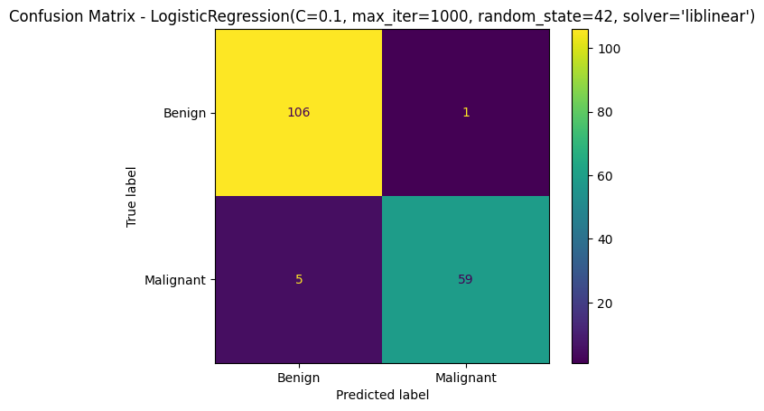

# 🩺 Breast Cancer Prediction using Machine Learning

This project explores and builds a **machine learning pipeline** to predict breast cancer diagnosis (benign vs malignant) using the **Breast Cancer Wisconsin dataset** from Kaggle.  
It covers the full data science workflow: from cleaning and feature selection to dimensionality reduction and model optimization.

---

## 📂 Project Structure

| Notebook                             | Description                                                                                                                           |
| ------------------------------------ | ------------------------------------------------------------------------------------------------------------------------------------- |
| `01_data_cleaning.ipynb`             | Data validation, dropping unnecessary columns (`id`, `Unnamed`) and ensuring data integrity.                                          |
| `02_eda_and_feature_selection.ipynb` | Exploratory Data Analysis (EDA), correlation inspection, and selection of the most relevant features.                                 |
| `03_dimensionality_reduction.ipynb`  | Applied **PCA** and **LDA** for dimensionality reduction.                                                                             |
| `04_modeling.ipynb`                  | Built and fine-tuned classification models: **Logistic Regression**, **SVM**, and **Random Forest**, and evaluated their performance. |

---

## 🧩 Workflow Summary

1. **Data Preparation**

   - Removed irrelevant columns and validated dataset consistency.

2. **Exploratory Data Analysis (EDA)**

   - Explored feature distributions, correlations, and class balance.
   - Visualized relationships between variables and diagnosis.

3. **Feature Engineering & Dimensionality Reduction**

   - Applied **Principal Component Analysis (PCA)** and **Linear Discriminant Analysis (LDA)**.
   - Found PCA to achieve the best balance between dimensionality reduction and performance.

4. **Modeling & Evaluation**
   - Implemented and compared three models:
     - Logistic Regression
     - Support Vector Machine (SVM)
     - Random Forest
   - Used grid search for hyperparameter tuning and evaluated with confusion matrix and classification metrics.

---

## 📊 Results

| Metric                   | Score |
| ------------------------ | ----- |
| **Accuracy**             | 96.5% |
| **Precision**            | 98.3% |
| **Recall (Sensitivity)** | 92.2% |
| **True Positives**       | 95.1% |

The **fine-tuned Logistic Regression** model achieved the best overall performance with high precision and recall, making it reliable for medical prediction use cases where minimizing false positives is critical.

---

## 🛠️ Tech Stack

- **Python** (Pandas, NumPy, Scikit-learn, Matplotlib, Seaborn)
- **Jupyter Notebooks**
- **PCA / LDA** for dimensionality reduction
- **GridSearchCV** for hyperparameter tuning

---

## 📈 Key Insights

- **Feature redundancy** was significantly reduced through PCA from 30 features down to 10 pca components, improving model interpretability.
- **Logistic Regression** proved highly effective after fine-tuning, outperforming more complex models like SVM and Random Forest on this dataset.
- Proper **data preprocessing and scaling** were crucial for optimal model performance.

---

## 🧑‍💻 Author

**Iyad Mahdy**  
Data Scientist | AI & ML Engineer  
[LinkedIn](https://linkedin.com/in/iyadmahdy) • [Kaggle](https://kaggle.com/iyadmahdy)

---

## 🩵 Acknowledgements

Dataset: [Breast Cancer Wisconsin (Diagnostic) - Kaggle](https://www.kaggle.com/datasets/uciml/breast-cancer-wisconsin-data)
